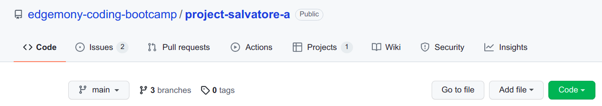
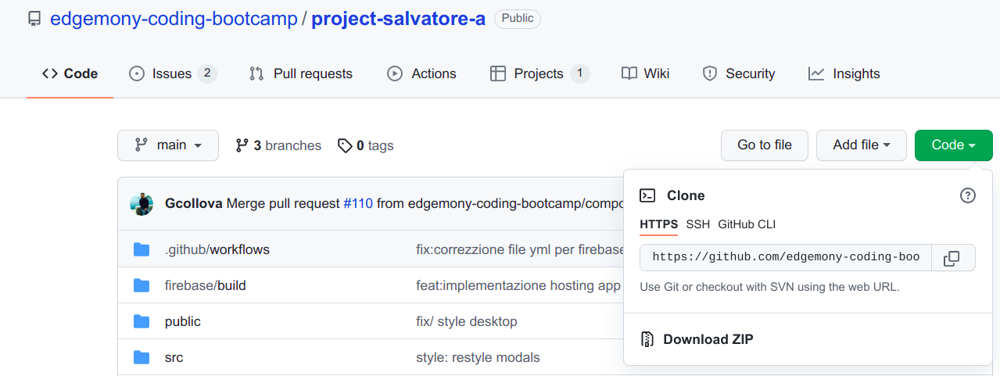
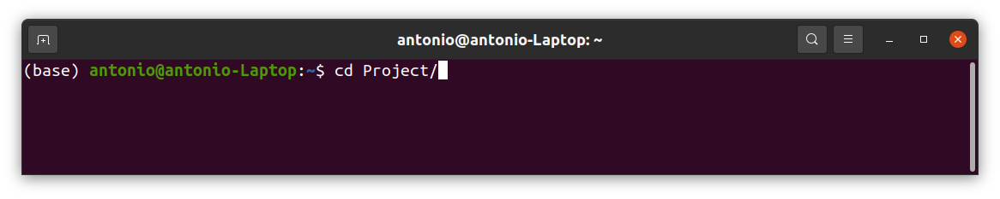
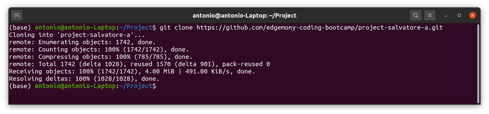
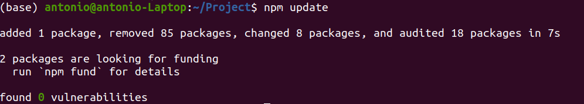

# Slack Clone
 >Web site created in the context of the Edgemony Bootcamp final project

## Table of Contents

- [Introduction](#introduction)
  - [Description](#description)  
  - [How does it work?](#how-does-it-work)  
  - [Try it](#try-it-now)
- [The Team](#introducing-the-team)
  - [Members](#team-members)
  - [Mentor](#mentor)
- [Project Setup](#project-setup)

# Introduction 

## Description
The goal of this project is to reproduce the main  characteristics of Slack, a platform to connect your team through a easy-to-use chat.

## How does it work?
After registering as a user, you can access different chat groups. Slack clone allows you to send and read messages in each group, create new chat groups and edit your messages

## Try it now!
### [>>> Start Slack-Clone!](https://fake-slack-faa26.web.app/)

# Introducing the team
Here we are! Meet the creators of Slack-Clone

## Team Members

- [Giorgio Collovà](https://github.com/Gcollova) 🔥
- [Silvia Lechthaler](https://github.com/silhth) 🍃
- [Alessandra Perricone](https://github.com/Aleperri98) 🐻
- [Maria Rotolo](https://github.com/MariaRotolo) 😼
- [Antonio Tutone](https://github.com/Tutanto) 🛰️

## Mentor

- [Salvatore Laisa](https://github.com/moebiusmania) 🦁

# Project setup

## Clone project locally
- On GitHub, navigate to the repo (you’re probably there right now, click the "Code" tab at the top).

- Click the green "Clone or download" button and copy the web URL.

- From your terminal, `cd` into the directory where you want this project to live.

- Once you’re in the directory, type git clone followed by the web URL you just copied to your clipboard from GitHub.

 - Then navigate into the project by typing `cd` followed by the project directory’s name.

 - Once you have the project locally and you are in the project directory, you’ll want to update all the project’s dependencies. To do so, type the following into your terminal: `npm update`

 

 ### Access the project in your browser

- After you’ve cloned the project locally and updated the dependencies, run the project by typing the following into your terminal: `npm start`. You should be able to see the project at `localhost:3000`.

🎉 You did it! You’re ready to start chatting!

## Features:
- Front-End in React JS (CRA)
- Back-end:
  - Firebase Authentication
  - Firestore Database
- Hosting by Firebase
- Sass
- User sign-up/login
- Searchbar for users/messages
- Full-Responsive
- Editable user profile
- Automatic log-out after 5 minutes of inactivity
